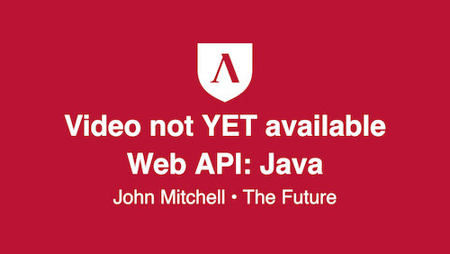

# Understand what to expect in the WEB API Java course

## What is the Java Course all About

 &nbsp;&nbsp;&nbsp;&nbsp; 

 

### Welcome to Java!!!

We will be studying WEB APIs Backend systems written in Java using the Spring Framework.

* Java is an object oriented, strongly typed programming language
* Spring is a Framework the extends Java to aid in writing WEB API Backend Systems, among many other things!
* We do nothing flashy. We serve up the data that flashy frontend systems use.
  * So what we do might not impress your friends but is the foundation for all information systems in the world!
* We will be developing software using the following tools
  * Java Development Kit (JDK)
  * Spring
  * JetBrains IntelliJ Idea IDE
  * Tomcat Webserver
  * and much more

### What does the course cover

| Topic                    | Monday                                       | Tuesday                                        | Wednesday                                            | Thursday                                                                       | Friday           |
|--------------------------|----------------------------------------------|------------------------------------------------|------------------------------------------------------|--------------------------------------------------------------------------------|------------------|
| WEB Java Fundamentals    | JDK, Types, Classes, Properties, and Methods | Conditionals, Loops, Collections, Initializers | Interfaces, Abstract Classes, Lambda Expressions     | Intro to Maven, Spring, and Tomcat including using JetBrains IntelliJ IDEA IDE | Spring Challenge |
| Java with RDBMS and APIs | RDBMS (PostgreSQL), SQL Basics               | WEB API CRUD Application with Read             | WEB API CRUD Application with Create, Update, Delete | Data Modeling with Custom Queries                                              | Sprint Challenge |
| Java Frameworks          | Exception Handling                           | Automated Unit Testing                         | User Authentication                                  | Deployment                                                                     | Sprint Challenge |
| Build Week               | Project                                      | Project                                        | Project                                              | Project                                                                        | Project          |

 

### Expectations of The Course

Scheduled Times (Lambda School Times) with Instructor

| Time     | Monday          | Tuesday         | Wednesday       | Thursday        | Friday                     |
|----------|---------------- |-----------------|-----------------|-----------------|----------------------------|
|  8:00 AM | TL only meeting | TL only meeting | TL only meeting | TL only meeting | Sprint Challenge Announced |
|  9:00 AM | Guided Project  | Guided Project  | Guided Project  | Guided Project  | TL only meeting            |
| 10:00 AM | Guided Project  | Guided Project  | Guided Project  | Guided Project  |                            |
| 11:00 AM |                 |                 |                 |                 |                            |
| 12:00 PM |                 |                 |                 |                 | Week wrap up Q & A         |
|  1:00 PM |                 |                 |                 |                 |                            |
|  2:00 PM |                 | Q & A           |                 | Q & A           |                            |
|  3:00 PM |                 |                 |                 |                 |                            |
|  4:00 PM |                 |                 |                 |                 |                            |
|  5:00 PM |                 |                 |                 |                 |                            |

Slack Channels - Where to turn for help

* A Set of Slack Channels will be created Just for Java
  * Cohort_**java**
  * Cohort_help_**java**
  * TLs remain in the Cohort_staff channels. We share those
  * Others might be created as needed
* You still need to monitor the general Cohort channels!
  * Items affecting all students get posted there
  * Node items might also get posted in the general channel. You can ignore those!
* **JX**
  * You will be added to the JX (Java eXperience channel)
  * Members include all at Lambda School who are working with Java
  * Of course membership is voluntary; you can leave the channel. However wealth of Java information in the channel
* **java**
  * A Lambda School public channel you are welcome to join.

Working with Technical Material

I have always said that to grasp technical material, you need to go through it 3 times. What we are studying is all technical material. The three stages of understanding technical material are:

* **Understand the plot**: what are we going to study today
* **Understand the details**: now that I know where we are headed, what are the details, the nuances, the I need to understand to use this material.
* **Implement the material**: now that I understand where we are headed and the details that will get us there, let's use that new knowledge!

This is how I see the material organized for the Java Unit

* **Understand the plot**: Watch the preclass videos in Training Kit. The material covered in the videos is roughly the same as the material in the written documentation of Training Kit. The Training Kit material contains a few key phrases
  * **Overview**: This is lecture time. Training Kit is conveying new material to you so pay attention!
  * **Follow Along**: This is time for hands on keyboard and follow along what is being done in Training Kit. You will remember much more of the material if you implement it yourself!
  * **Additional Resources**: These are links to study more about the topic at hand. Some of the link present alternative ways of handling the same topic. These are meant for future, enhancement, enrichment, study!
* **Understand the details**: Now come to the guided project class time with ideas of what we are going to cover. The guided project is a time for you to follow along with the instructor to further understand the details of how to implement the topics discussed in Training Kit. The guided project is a time to see how all the topics come together to form a complete application.
* **Implement the material**: Now you are on your own to do the module project. The written material in Training Kit serves a great resource for helping you through the module project!

Comments for Success

* Not a competition
  * A creative man is motivated by the desire to achieve, not by the desire to beat others – Ayn Rand
  * Enough Java positions to go around
  * We are better together
  * Work together - a rising tide lifts all boats
* HARD, Yes it is
  * It’s suppose to be hard. If it wasn’t hard, everyone would do it. The hard is what makes it great – Tom Hanks in A League of Their Own
* Learning something new - follow the 20 Minute Rule
  * Researching solution for around 20 minutes
  * When searching the Web
    * Restrict your searches to just the last year or so. Most search engines have a Tool to do this. Java has been around for awhile and has changed over the years. You want the latest information!
  * When asking for help, ask on the channels. This way we all can benefit from the answers. I do monitor the channels!
  * Answer questions in the channels. Best way to learn something is to explain it to others!
* Finish
  * The economy is run by those who show up. Success comes to those who finish.
* Career Education Important
  * Give your job search as much effort as you are giving learning the technology!
  * Technical Education + Career Education = **SUCCESS**
* To be a productive Java programmer, you will need to continuing studying Java Spring after the course. Materials and resources are provided to do this. However, this does require extra work on your part!

 

## Who is teaching the course

 &nbsp;&nbsp;&nbsp;&nbsp; 

The instructor is me, **John Mitchell**.

* I have 15+ years of experience as a software engineer.
* I have 15+ years of experience as an instructor.
* I started using Java the day it came out! And have been using it ever since!

* I live in Port Angeles, Washington, USA with
  * my wife, daughter, son sometimes (he is in college).
  * And as you will meet during the class some other family members
    * BarnBarn and Cinnamon, my daughter's two rabbits
    * Tiger, my daughter's cat
    * Our dogs Dottie and Ginger

 &nbsp;&nbsp;&nbsp;&nbsp;  &nbsp;&nbsp;&nbsp;&nbsp; 

 

 &nbsp;&nbsp;&nbsp;&nbsp; 

To contact me (which you should always feel free to do!)

* Lambda School Slack: `@John`
* email: `john@lambdaschool.com`
* LinkedIn: [https://www.linkedin.com/in/john-mitchell-mba/](https://www.linkedin.com/in/john-mitchell-mba/)
